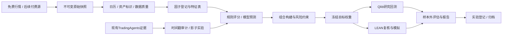

# 项目架构、模块边界与接口契约

状态：待开发设计。约束来源：ETF优先、日线、先免费、做多起步、后续支持做空/期权。

## 1. 产品需求

系统每天回答：数据是否完整；哪些因子可在当时计算；策略想持有什么；扣成本后历史表现怎样；今天的信号能否通过风险门；每个结论能否复现。

第一阶段接受日线ETF OHLCV、分红/拆分、交易日历与静态研究池；输出研究报告和模拟目标仓位。账户资金默认 `100000 USD` 仅用于研究可比性，可配置，不代表用户真实本金。生产交易、券商权限、真实本金及税务处理在接入券商前单独确定。

产品成功不以“生成买入建议数量”衡量，而以可复现性、时序正确性、成本后对照结果和失败可解释性衡量。

## 2. 数据流



LEAN 使用同一份冻结信号和目标权重，不在其内部重新生成另一套评分；模型训练也不依赖回测结果即时自我修改。

## 3. 推荐项目目录

为避免影响当前预测环境，新增目录是独立 Python 子项目，单独 `pyproject.toml` 和锁文件。Windows 编辑，WSL2/Linux 为推荐研究运行环境；实际运行环境先做兼容性探测。

```text
TradingAgents/
  docs/quant_research/                # 本次已创建的规格与提示词
  quant_research/                     # 以下均为拟创建
    pyproject.toml
    uv.lock                          # 或固定另一种锁定工具，不能混用多套真相
    configs/
    src/quant_research/
      cli.py
      contracts/                     # typed config / data schema / statuses
      calendars/
      data/{providers,quality,actions,universe}/
      factors/{expressions,registry,diagnostics}/
      models/{baseline,lightgbm,validation}/
      portfolio/{weights,risk,turnover}/
      engines/{qlib_adapter,lean_export}/
      integrations/tradingagents/
      evaluation/
      reporting/
      orchestration/
    tests/{unit,integration,fixtures}/
    data/{raw,normalized,features}/   # 不提交大数据和供应商受限数据
    state/research.duckdb
    outputs/<run_id>/
    runtime/lean/                    # 独立版本/镜像，不污染Python环境
```

不要仅把目录加入根项目 `setuptools include`；明确在新子项目环境执行，记录解释器路径。WSL内大数据与缓存优先存Linux文件系统，Windows工作区只存代码/小文档；如迁移到工作区外，实施时按环境权限处理。

## 4. 模块规格

| 模块 | 输入 → 输出 | 主要职责 | 不变量 / 失败处理 |
|---|---|---|---|
| M00 环境与配置 | 配置 → 验证配置、环境manifest | 依赖锁、时区、路径、功能开关 | 未知字段或不支持价格口径直接拒绝 |
| M01 数据接入 | 请求 → 原始快照与manifest | 增量采集、重试、限速、校验hash | 不覆盖已发布快照；不静默跨源拼接 |
| M02 数据规范 | 原始数据 → 规范行情/事件表 | XNYS日历、价格单位、公司行动 | 缺失不自动变0；缺开盘不可成交 |
| M03 资产池 | 资产元数据+日期 → 当日可选标的 | 上市/终止、预热、流动性、排除原因 | 不在成立前交易，不把今日池称为PIT全市场 |
| M04 因子 | 可得数据+规格 → 因子值/版本 | 表达式、缓存、变换、质量诊断 | 变换只在训练窗口拟合，不使用未来收益 |
| M05 训练与验证 | 标签+时间分割 → 模型/预测 | 规则基线、LightGBM、滚动验证 | 每次fit保存训练区间；不随机切分日期 |
| M06 组合 | 评分+持仓 → 目标权重 | 排名缓冲、现金、敞口、换手/容量限制 | 约束不可行时降低风险或留现金，不能偷偷放宽 |
| M07 回测适配 | 权重+行情+费用 → 账本/净值 | Qlib研究、LEAN独立复核 | 引擎差异可对账；明确归一价格或真实股数 |
| M08 报告与实验 | run artifacts → HTML/JSON/Markdown | 基准、样本外、压力情景、结论 | 不把缺测收益填写为0，不只展示赢家 |
| M09 Agent桥接 | 已保存证据 → 事件特征 | JSON解析、时序校验、影子比较 | LLM文本不直接生成订单，不把评级当概率 |
| M10 每日运行 | 配置+冻结版本 → 当日研究包 | 锁、幂等、重试、异常恢复 | 数据失败时无新风险增加；重复运行不重复订单 |
| M11 扩展交易 | 借券/期权数据 → 新账本组件 | 做空、融资、链数据、保证金、指派 | 数据不具备则禁用该研究模式 |

## 5. 跨模块接口

以下是接口设计，不代表已存在的API：

```python
fetch_snapshot(request: DataRequest) -> SnapshotManifest
normalize(snapshot: SnapshotManifest, rules: PriceRules) -> DatasetRef
universe_at(decision_at: datetime, dataset: DatasetRef) -> UniverseSelection
compute_factors(specs: list[FactorSpec], inputs: DatasetRef) -> FactorFrame
make_labels(spec: LabelSpec, prices: DatasetRef) -> LabelFrame
fit_predict(split: TimeSplit, features: FactorFrame, labels: LabelFrame) -> PredictionSet
build_targets(scores: ScoreFrame, state: PortfolioState, rules: RiskConfig) -> TargetSet
run_backtest(targets: TargetSet, engine: EngineConfig) -> BacktestArtifacts
evaluate(run: BacktestArtifacts, baselines: list[RunRef]) -> EvaluationReport
publish_manifest(artifacts: RunArtifacts) -> ImmutableRunManifest
```

所有ID使用稳定资产标识，ticker只是有有效期的显示名称。时间字段带时区且落库UTC；session是交易所当地交易日期。金额、权重、bps字段显式标单位。

### TargetSet：最重要的系统边界

每条记录至少包含：`run_id, strategy_id, strategy_version, asset_id, decision_at, generated_at, earliest_execution_at, target_weight, score, reason_codes, data_snapshot_id, factor_version, model_version, risk_config_hash`。

- `decision_at` 表示此次可见信息截止时间；`generated_at` 是实际生成完成时刻，不能伪造历史生成时间。
- `generation_mode=historical_reconstruction` 时，实际 `generated_at` 只作本次计算审计；模拟成交依据历史 `decision_at`、历史可得时间及登记的计算延迟，结果不能标为当时实时生成。
- `generation_mode=forward` 时，最早成交不早于实际生成完成、实际收到数据及下一允许交易时段；若任务延迟到次日开盘以后，不倒填开盘订单。
- 多头默认 `weight>=0`、总风险资产权重不超过1；现金单列。
- 每个决策时刻所有合格资产都写出目标权重，未选中标记0，避免引擎把漏行理解成继续持有。
- `daily_evaluation=true` 不等于 `daily_forced_trade=true`；权重缓冲和单日换手上限由组合模块统一应用。

### 状态机

```text
draft → data_checked → features_frozen → targets_frozen
      → backtested_research → audited → paper_candidate → paper_observed
任何阶段 → failed / insufficient_data / rejected
```

`audited` 表示工程和账本检查通过，不等于证明有alpha；业绩判断保存在独立字段。免费历史选择偏差未解决时保留 `research_only` 标签。

## 6. 与现有代码对接

| 现有文件 | 可复用经验 | 对接限制 |
|---|---|---|
| `prediction_research/evaluation.py` | 日期分组、标签成熟后训练、walk-forward | 当前概率分类指标不能代替组合收益；需增加持仓账本 |
| `prediction_research/features.py` | 次日开盘至未来收盘的标签思路 | 必须扩展分红/拆分与XNYS日历；不同horizon明确定义 |
| `prediction_research/evidence.py` | available/observed时间、hash、证据不可变 | 现有配置与资产验证针对国内ETF，新系统需独立美股schema |
| `prediction_research/archives.py` | 脱敏manifest和不可变归档 | 不复制密钥/环境文件，不共用可变数据库 |
| `prediction_research/tradingagents_adapter.py` | Buy/Overweight等评级的语义 | 不能把Overweight当必涨，字符串解析失败不能猜测 |
| `tradingagents/agents/schemas.py` | 结构化决策对象 | 模型“信心”没有自动变成校准概率 |
| `tradingagents/reporting.py` | 报告树组织 | 自然语言研究报告并非交易证据 |
| `daily_artifacts.py` | 当前工作区已有JSON归档实现 | 属于用户未提交改动，开发时读取接口并保护，不覆盖 |
| `run_backtest.py` | 历史日期LLM分析入口 | 不具备多资产成交、费用和现金账本，不能作为本系统回测引擎 |

优先读取现有已冻结 JSON；不要由新环境直接导入整个 TradingAgents 模型栈。未来需要新分析时，使用有超时、预算、参数校验的独立进程适配。既有 `--screen-evidence` 有国内ETF语义，不能未经适配直接塞入美股组合目标权重。

## 7. Agent的可验证作用

按相同冻结日期分别比较：A=量化规则；B=A+结构化事件特征；C=A+事件风险减仓；D=Agent独立策略。每次只改变一个组件，并包括成本、延迟、缺失和API支出。

当前大模型可能在训练中见过历史事件结果。即使提示“你只能看到某日以前”，历史回放也不能自动消除此污染。因而Agent是否提升收益主要依赖**从现在开始冻结的前向记录**；历史回放仅用于接口和方法探索，标签单独保存。

LLM默认关闭，API预算为0；规则因子和ETF基线不依赖任何模型API。仅在预先登记的实验中启用覆盖层，关闭后主系统仍可完整运行。

## 8. 运行与交付原则

- 本地CLI先于Web界面，报告先用HTML/Markdown；仅当使用需求明确时增加Streamlit。
- 数据写入临时目录，校验完成后原子发布；单写者维护DuckDB，不多进程抢写同一文件。
- 运行manifest记录git commit、dirty diff hash、锁文件hash、快照hash、seed、操作系统、引擎版本和全量参数。
- 失败信号不自动解释为空仓卖出指令；研究任务失败应冻结新增风险，已有模拟持仓依预先定义的失败策略处理并发出本地状态。
- 每次交付可独立运行的模块及真实验证结果，不要求用户在尚无成果时反复批准例行实现选择。
