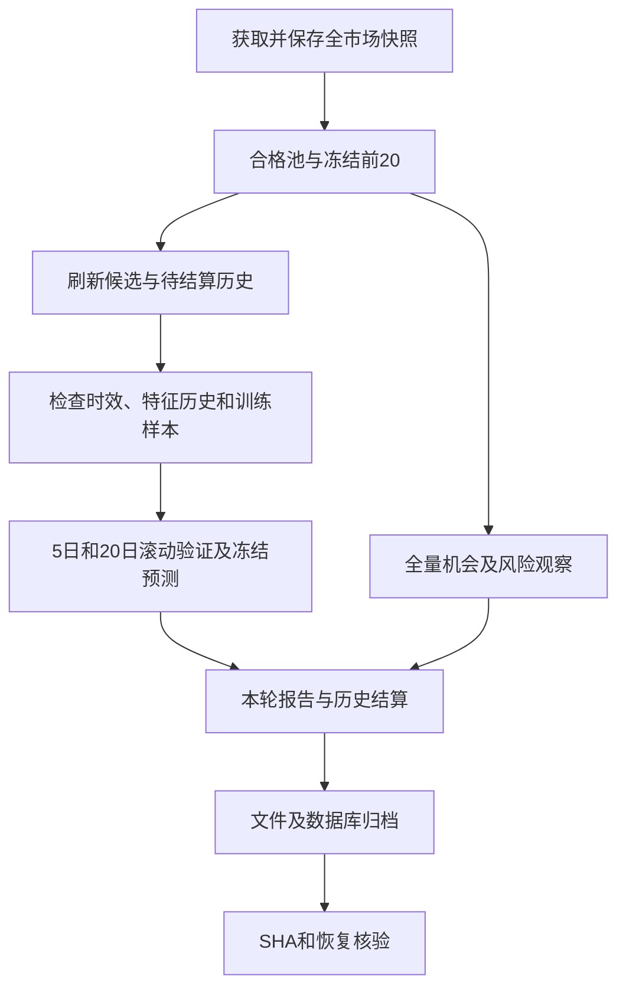

# ETF 粗筛、预测与每日归档整改实施手册

日期：2026-09-15。范围：现有 ETF 研究流程、评级解释和文件归档。本文随实施更新；工程验收与策略有效性分别记录。

## 实施顺序与完成标准

| 步骤 | 工作 | 完成标准 | 当前状态 |
|---|---|---|---|
| 1 | 保存基线、盘点数据与已有存储 | 原代码/报告可追溯，旧预测不覆盖 | 已完成 |
| 2 | 修复训练和校准的时间隔离 | 按日期切分，跨边界标签剔除，标的顺序不影响结果 | 已完成并测试 |
| 3 | 明示概率收缩与模型质量 | 输出原始概率、收缩系数、训练基准和验证依据 | 已完成并测试 |
| 4 | 粗筛机会/风险分类及覆盖 | 全合格池观察、风险端覆盖、数据不足单列 | 已完成；类别策略增益待研究 |
| 5 | 评级与仓位动作语义修复 | 五档评级完整识别，减持不冒充下跌预测 | 已完成并测试 |
| 6 | 每日文件归档和恢复验证 | 每轮独立目录、清单与哈希、数据库一致性快照 | 已完成；真实隔离恢复通过 |
| 7 | 单元/集成/回归验收 | 对应风险点均有可复现测试 | 已完成，记录见末节 |
| 8 | 同数据旧新版本回测 | 5/20 日同样本成对比较、成本和样本限制明确 | 已完成；不自动晋级 |
| 9 | 运维交付与后续研究计划 | 命令、验收门、故障处理、恢复和推进条件齐全 | 本文及归档指南已整理 |

本文为后续接手 Agent 的主入口。历史缓存实验只用于比较实现，不构成新的实时市场建议。每日存储细节另见 [归档与恢复指南](ETF_ARCHIVE_GUIDE.md)。旧的 9 月 6 日方案保留作历史记录；默认数量、版本与校准规则以本文和当前代码为准。

## 一、整改结论与问题清单

本次目标是让结果有区分、有解释、可复现，扩大观察覆盖，并使每日预测可以核查和恢复。BUY 数量、类别是否每天齐全，均不作为验收指标。

### 1.1 已核实的基线

- 基线代码来自修改前工作区，对应最近提交 `92c00ff`；修改前研究模块 57 项测试通过。
- 9 月 6 日最后一轮完整 cycle 使用 9 月 4 日行情：1601 条记录、1120 条合格、20 个冻结候选、5 个预测标的。
- 该轮 5 日输出全部为 0.5172。使用相同 CSV 哈希复现，确认旧校准混合系数为 0，即退回核心训练集上涨比例，不是五个相同的市场机会。
- 旧 5 日 Brier 0.253087，高于历史上涨率基线 0.250798；旧 20 日为 0.269412，高于基线 0.254310。越低越好。
- 旧大模型记录在 `results/daily`，6 对文件集中于 `3032.HK`，含同日重复；其中 5 次 Underweight、1 次 Hold，不能代表全市场，也不能用于解释量化模块的校准行为。
- 当时资金流只有 1 个独立观察日；5/20 日累计窗口与真实动态粗筛策略均缺历史。

### 1.2 问题、原因与处理

| 编号 | 问题 | 已确认原因 | 本次处理 |
|---|---|---|---|
| P01 | 最终候选很少 | 粗筛前20再截前5；同组最多1只 | 默认量化申请前20；显式展示申请、可预测、实际冻结与排除原因 |
| P02 | 概率挤在一起 | 校准允许收缩至历史上涨率 | 保留合理回退；新增原始概率、系数、基率、区分状态，回退不能标正式模型信号 |
| P03 | 校准受标的顺序影响 | 按标的拼接后按行对半切 | 改为按日期、代码稳定排序；同日标的在同一段 |
| P04 | 校准独立性不足 | 核心训练标签跨入校准期；校准拟合标签跨入混合系数选择期 | 两个内部边界都按标签到期日严格剔除 |
| P05 | 无机会/风险类别 | 仅单一高分排名，缺弱势端 | 全合格池观察分类；机会榜和资金流出/弱势风险榜分别展示 |
| P06 | 评级语义混乱 | 增持/减持未识别；仓位动作和价格方向混用 | 五档结构化解释；增减敞口不计涨跌命中率；未知不变成HOLD |
| P07 | 改候选/配置后可能复用旧身份 | 冻结版本没有包含训练配置与候选池 | 版本升级并附规范化配置/资产池哈希；同规格仍首次冻结 |
| P08 | 回测与当前输入不一致 | 缺失资产可能静默缩池，旧回测仍被引用 | 独立predict/backtest拒绝未声明缺失；验证检查输入标的及CSV哈希 |
| P09 | 不合格输入产生虚假概率 | NaN/Infinity与异常OHLC可能进入特征 | 数据入口与模型入口分别拒绝非法输入 |
| P10 | 报告与预测质量门不同 | 展示层只检查行数和Brier | 共用质量门，增加实际日期覆盖检查 |
| P11 | 保存文件不等于完整备份 | 运行产物分散，CSV会更新，活动DB可能有WAL | 每轮独立归档，SHA清单、输入副本、SQLite一致性快照、恢复测试 |
| P12 | 分类依据可能被后续刷新覆盖 | 先粗筛读取CSV，随后下载覆盖缓存 | 分类读取的历史按内容SHA先冻结，再归档 |

## 二、实施后的流程与职责



1. **粗筛层**回答研究优先级。现有分数、同组限额、前20冻结选择保持原定义，不为增加买入数量调整权重。
2. **观察层**回答当下属于哪类机会或风险。它不改变筛选排序，不把描述性标签当作经过验证的交易策略。
3. **概率层**回答未来5/20交易日从下一开盘入场到目标收盘的上涨概率。它不直接预测收益幅度或最优仓位。
4. **质量层**分别记录数据是否齐全、概率是否仅为基率、模型是否通过条件验证、完整策略是否有证据。
5. **评级层**保留大模型的仓位意图。当前 `skip_tradingagents=true` 继续有效；量化扩大到20，不会自动恢复LLM调用。
6. **存储层**同时保留首次冻结的预测事实、后续到期结算与每轮完整归档。

### 2.1 数量与部分数据就绪

- `workflow.prediction_top_n=20`；`cycle --top 5` 可显式限为5。
- `workflow.agent_top_n=5`；未来恢复LLM时，其预算与量化覆盖独立。
- 股票/商品/多资产、最低成交额500万元、最低市值5000万元、分组限额1，继续来自现有配置。
- `candidate_symbols` 表示申请列表；`prediction_eligible_symbols` 表示特征数据检查后的列表；真正产出以 `prediction_ids` 和预测文件为准。
- 刷新失败标的先排除，再让其余成功数据对齐日期；逐代码记录缺历史、过期、未来日期、刷新失败等原因。
- 两只及以上合格标的可继续混池研究；不足两只时等待。这里“合格”不等于通过模型验证。
- 日线加载和分类至少需要61根有效日线；模型训练另需足够已到期标签、两个目标类别及配置的训练日期。训练不足按周期列为等待。
- 某个标的退出本轮候选，仍在待结算集合中继续更新；不能因为排名下降就遗失历史结果。

## 三、模型整改的实现规则

### 3.1 三段训练和两个内部隔离边界

外层滚动回测的测试起点为 T，进入训练的所有标签必须满足 `target_end_date < T`。内部再划分：

1. 最近训练窗口按日期稳定排序，每天所有标的在同一组；默认最多756个日期。
2. 后20%的训练日期作为校准期；前段拟合量价模型。
3. 前段只有 `feature_date < calibration_start` 且 `target_end_date < calibration_start` 的样本能够保留。
4. 校准期再按日期一分为二：较早部分拟合校准函数，较晚部分选择收缩系数。
5. 较早校准部分的标签必须在较晚部分起点之前到期，跨边界样本剔除。
6. 核心段不足40行或只剩单一类别时，允许用外层训练资料拟合未校准模型，但不能声称完成独立校准；具体原因写入诊断。
7. 校准行数不足、日期不足或类别不足，保留未校准状态，不能伪造校准成功。

外层测试隔离原先已存在；本次修复的是两个内部校准边界及按标的块切分的问题。不能把旧缺陷描述成已经证实所有外层回测都使用了未来测试标签。

训练和实时预测现在共用 `evaluation._fit_model`，避免两条路径逐渐产生不同的切分口径。

### 3.2 保留与增加的模型信息

`prediction_*.json` 每只标的保留：

| 字段 | 用途 |
|---|---|
| `probability_up` | 原系统冻结的最终上涨概率 |
| `raw_probability_up` | 校准前概率，便于解释收缩幅度；不能作为绕过验证门的交易概率 |
| `discrimination_status` | `baseline_only`、`model_differentiated`、`uncalibrated` |
| `model_diagnostics` | 基率、校准参数/混合系数、每段样本量、剔除量、日期边界和回退原因 |
| `model_state` | 均值、尺度、权重、截距及校准状态，用于重放检查 |
| `validation` | 匹配的回测、检查结果和原因 |
| `data_snapshot` | 原始行情路径、SHA和日期 |
| `decision_at_utc`、`feature_date` | 决策时间与行情时间，不能混用 |
| `prediction_id`、`model_version` | 冻结身份与实现/规格版本 |

基础模型升级到 `price-volume-logistic-v3`，粗筛候选模型升级到 `screened-flow-price-logistic-v5`；商品外部和分敞口模型对应升级到v2。最终标识附配置及资产池哈希，区分不同实验规格。旧预测、旧版本和旧结算不迁移覆盖。

### 3.3 发布与解释

- 现有条件模型质量门要求至少1000行样本外预测、60个不同特征日期，且模型Brier严格低于滚动历史上涨率基线；必要数值必须有限。
- 60个日期不是60个独立收益样本；5/20日标签会重叠。此门只是最低质量检查，不等于统计显著性或可交易证明。
- 校准混合系数为0时，即使总体条件回测合格，该输出也不能标为有效模型交易信号，使用 `research_only_baseline_fallback`；若总体验证失败，保留失败状态并单列 `baseline_only`。
- 历史上涨率高于55%不代表当前某只ETF出现新的买点。
- 独立predict读取的行情哈希与匹配回测不一致，标为验证失败；应重做回测，不能沿用旧“通过”。
- 截面资金流仍是筛选/解释证据，没有直接修改上涨概率。增加资金特征要走独立增益实验，不能通过提示词把流入金额解释成概率。

## 四、粗筛分类的具体定义

### 4.1 两组标签并行

单日截面独立显示：价涨流入、价跌流出、价格资金分歧、中性或数据不足。它只陈述该日观察，不使用“连续流入”“机构加仓”等未经数据支持的说法。

有至少61根合格历史、满足决策时点与时效要求时，按以下优先顺序给出六类。阈值完整保存在 `opportunity.RULES`，另有版本和规则SHA；这里是初版描述规则，尚未获得策略回测认证。

| 优先序 | 类别 | 当前规则摘要 | 后续观察 |
|---|---|---|---|
| 1 | 高位分歧 | 20日涨幅≥8%或高于MA20至少4%，同时资金流出或大单看空背离 | 分歧是否解除；持仓者复核退出条件 |
| 2 | 超跌修复 | 20日收益≤−6%，距60日最高收盘回撤≤−8%，5日收益≥1%，当日净流入非负 | 修复能否延续，不能直接称趋势反转 |
| 3 | 趋势走弱 | 收盘<MA20<MA60，且20日收益为负 | 是否收复均线，复核原交易逻辑 |
| 4 | 回调观察 | MA20>MA60、20日收益正、20日回撤至少2%、仍在MA60之上、5日收益≤2% | 等待回调后转强确认 |
| 5 | 趋势延续 | 收盘≥MA20≥MA60，20日涨幅>1%，当日净流入为正 | 趋势是否保持，后续资金是否支持 |
| 6 | 震荡无优势 | 数据完整但未满足上述条件 | 等待可复核的触发条件 |

历史不足、时间来源未知、可得时间晚于决策、行情过期、非法OHLC等，分类为 `insufficient_data`；不能为了填满六类而将其归入震荡或HOLD。

### 4.2 机会榜与风险榜

- 机会观察：单日净流入占比≥3%、净额为正、涨幅非负，或者历史属于趋势延续/回调观察/超跌修复。
- 风险观察：单日净流出占比≤−3%、净额为负，或者历史属于高位分歧/趋势走弱。
- 两榜基于全量合格池，位于原前20之外的流出标的也会显示；每榜默认展示前20，完整逐项观察留在粗筛JSON。
- 两榜允许交叉。例如趋势还保持但当日大额流出，可同时值得关注和需要风险复核。
- 没有持仓输入时，`trade_action=null`、`holding_context=not_provided`。风险榜不是自动减持清单。
- 资产类型、行业/主题分组、境内/跨境标签与机会类别分开。当前分类主要来自名称规则，无法替代基金合同核验。

### 4.3 时间与历史输入保真

历史CSV在分类时按SHA复制到 `datasets/market/snapshots/<sha>/cache_代码.csv`。后续正常采集覆盖主缓存时，旧分类依据仍存在；归档通过 `history_snapshot` 收集这些输入。

有绑定SHA的真实采集时间时才可明确证明该份历史在指定时点可得。既有ETF缓存通常只有文件修改时间，这只是当前文件来源的弱证据；报告明确 `filesystem_mtime_only` 和 `point_in_time_verified=false`，不能拿它回填严格历史交易策略。

同日重跑仍返回原冻结候选；新观察放在独立的 `current_opportunity_observation`，不补写旧冻结分类。新的描述不能伪装成旧决策时已经存在的依据。

## 五、五档评级与交易动作

| 评级 | 动作意图 | 价格方向统计 |
|---|---|---|
| Buy / 买入 | 建立或增加多头敞口 | 沿用旧系统up口径 |
| Overweight / 增持 | 增加敞口 | 不直接作为上涨预测计分 |
| Hold / 持有 / 观望 | 维持/等待 | neutral，不计方向命中 |
| Underweight / 减持 | 减少敞口 | 不直接作为下跌预测计分 |
| Sell / 卖出 | 退出或回避 | 沿用旧系统down口径 |

解析仅接受独立评级、明确评级字段或清晰的简短建议。正文中碰巧出现BUY、BUYBACK、多选评级或相互冲突的字段，保留未知/歧义；不能降级成HOLD。历史已经结算的行不回写；新输出携带 `decision_semantics`。

Buy/Sell的旧方向记分仍是简化口径，不等于实际买卖收益。以后接入账户持仓时，还应记录持仓成本、当前比例、计划期限、退出条件与风险预算，再将“行情判断”转成“是否采取动作”。该账户层本次未实现，也不假定用户已经持有候选。

## 六、每日记录和备份整理

### 6.1 沿用已有文件

1. `prediction_research/runs/`：每轮粗筛、预测、回测、综合报告与cycle JSON。
2. `prediction_research/state/research.db`：首次冻结的预测、证据、后续结算及运行映射。
3. `results/daily/`：旧daily大模型脚本的JSON/Markdown；继续保留原文件。
4. `reports/<ticker>_<date>/`：原TradingAgents完整报告树；同日相同标的可能复用目录。

旧daily脚本的分钟级文件名与截断Markdown存在局限；本次已盘点并写入归档指南。新的自动归档接入ETF `cycle`，没有把旧daily脚本冒充已经完成全量迁移。后续若继续使用旧daily，应按相同run_id方案单独接入，保留完整结构化输出并解决同分钟覆盖。

### 6.2 自动归档契约

每次正常或失败的cycle结束后，按决策所在本地日期和cycle_id创建独立归档：

```text
prediction_research/archives/YYYY-MM-DD/<cycle_id>/
  cycle.json
  config.redacted.json
  artifacts/a00002.json ...      # 短文件名，原名和路径保留在manifest
  inputs/i00006.csv ...
  state/research.db
  manifest.json
  manifest.sha256
```

- 原子发布：写临时目录、校验、再改为正式目录。失败保留明确的partial/FAILURE标记，不宣称成功。
- 数据库通过SQLite在线backup复制已提交状态，包括WAL；校验副本可独立查询。不是直接复制活动主文件。
- 所有文件记录SHA、大小、来源和原名；有预期输入SHA时先核对。缺失或已改写输入明确 `incomplete`。
- 配置递归脱敏；数据库副本仅对运行配置的敏感字段脱敏，并记录转换；不声称副本与活动数据库字节完全相同。
- 同一请求重试验证并复用；相同ID不同内容拒绝覆盖。已缺少的旧原始输入不能由当前缓存伪造补齐。
- cycle现在保存有效运行配置、Python/平台及源码SHA。模型参数和输入副本已经入档；源码哈希不等于源代码备份，仍需保留对应Git修订及未提交补丁。
- `verify_archive.ok` 表示归档内字节完整，`complete` 表示要求的材料齐全，两者都要看。
- 默认归档失败或不完整使最终cycle `outcome=partial_failure`，CLI返回2；即使预测已生成，也不能把备份失败隐藏掉。
- 研究Markdown在归档前生成，明确最终备份状态以cycle JSON的 `archive` 为准，避免修改已归档报告破坏SHA。
- 输入采集范围为显式引用的行情、截面、分类历史及JSON阶段产物。新闻原文、外部Agent目录不递归打包，不能声称归档涵盖全部外部上下文。

### 6.3 每日运行与检查顺序

在仓库根目录执行：

```powershell
# 使用已安装依赖的解释器，正常盘后刷新并运行
& ./.venv/Scripts/python.exe -m prediction_research.cli cycle

# 查看最新一轮及等待项
& ./.venv/Scripts/python.exe -m prediction_research.cli status

# 将路径替换为本轮返回的 archive_path
& ./.venv/Scripts/python.exe -m prediction_research.cli verify-archive '<archive_path>'

# 如要复核/补档已保存cycle，使用该轮JSON；新轮次会读取其runtime_config
& ./.venv/Scripts/python.exe -m prediction_research.cli archive-cycle '<cycle_json_path>'
```

每日按顺序检查：数据日期是否为预期交易日→采集是否成功→申请/排除/实际数量→分类与数据质量→两个周期验证状态→冻结ID→到期结算→归档完整性→本轮退出码。

`--skip-fetch` 只用于缓存验收。旧行情超过新鲜度门槛时拒绝生成今天的新预测，保留失败记录。它不能替代每天正常采集。周末重复运行不会创造新的资金流观察日。

本次不新建系统计划任务。将上面的cycle命令接入现有调度器即可；需保证工作目录、解释器和单实例运行正确，调度器保留stdout/stderr并检查退出码。发现已有另一套调度器时先统一入口，避免并发更新latest指针和CSV。

### 6.4 恢复与异地副本

恢复时先把归档复制到新的隔离目录，校验manifest和所有文件SHA，然后只读查询数据库中的预测ID/概率/结算状态；按manifest的原文件名重建测试行情目录和配置路径。禁止直接覆盖活动库来“测试能否恢复”。

建议每月演练一次，记录恢复时长、归档日期、材料完整性、查询数量和差异。同一磁盘上的archives是本地历史副本，不能应对整盘故障；后续应选择第二块磁盘或受控远端作为第二份副本，先确定目标和权限再配置复制。当前不自动上传、不自动清理历史。

建议保留策略：至少保留全部前瞻验证期间的原始每日包；容量规划后再决定日/月层级压缩与保留期。任何清理须先确认异地副本可恢复，不能仅因文件多就删除唯一证据。

## 七、完整测试计划与验收矩阵

### 7.1 执行命令

```powershell
& ./.venv/Scripts/python.exe -m pytest prediction_research/tests tests/test_archives.py -q
& ./.venv/Scripts/python.exe -m prediction_research.calibration_audit --help
git diff --check
```

测试使用临时目录和合成行情，不把合成数据计入真实研究结果。解释器为工作区 `.venv`；不依赖另一个缺pytest的全局Python。

### 7.2 必须通过的自动化场景

| 组 | 场景 | 预期行为 | 对应测试文件 |
|---|---|---|---|
| T01 | 核心训练标签跨校准起点，5/20日 | 全部剔除，保留标签严格早于边界 | `test_calibration_temporal.py` |
| T02 | 校准拟合标签跨收缩选择起点 | 全部剔除，同日标的不拆段 | 同上 |
| T03 | 反转标的顺序、随机打乱行 | 同一模型参数和概率 | 同上 |
| T04 | 加入未来观测 | 过去样本外预测不变 | 同上 |
| T05 | 混合系数0、校准不足、单一类别 | 明确基准回退或未校准，不伪造买点 | 同上 |
| T06 | 新模型参数和状态冻结 | 保存原始/最终概率及可重放参数 | 同上 |
| T07 | 配置/资产池改变、资产缺失 | 身份隔离或明确拒绝，不能沿用全池身份 | 同上 |
| T08 | NaN、Infinity、异常OHLC、维度不符 | 数据/模型入口拒绝，不输出虚假极端概率 | `test_remediation_integration.py`、`test_calibration_temporal.py` |
| T09 | 六种观察类、重叠条件和边界 | 按版本化优先序分类 | `test_opportunity.py` |
| T10 | 缺历史、未来时间、过期、未收盘K线 | 数据不足；未来K线不影响过去类别 | 同上 |
| T11 | 排名尾部流出ETF、同日重跑 | 风险榜覆盖；旧冻结候选和依据不变 | 同上 |
| T12 | 先分类再覆写行情、既有快照损坏 | 原SHA副本不变；损坏拒绝复用 | 同上 |
| T13 | 5档英文/中文、BUYBACK、叙述、多选冲突 | 正确仓位语义，未知不默认为HOLD | `test_rating_mapping.py` |
| T14 | 增持/减持到期结算 | 不计涨跌命中，旧结果不回填 | 同上 |
| T15 | 缺一个历史但其他两个完备 | 合格子集继续，排除代码和原因可查 | `test_remediation_integration.py` |
| T16 | 本轮刷新失败、候选全空、回测/报告失败 | 不拿旧结果冒充本轮；失败记录落盘 | `test_cycle_remediation.py` |
| T17 | 行数足但日期不足、指标非有限 | 预测和Markdown一致判未通过 | `test_remediation_integration.py` |
| T18 | 回测后行情SHA变化 | 当前验证失效，提示重新回测 | 同上 |
| T19 | 同日重复预测和模型规格改变 | 同规格返回旧冻结值，新规格独立身份 | `test_cycle_remediation.py`、`test_calibration_temporal.py` |
| T20 | 正常备份、WAL已提交记录、独立恢复 | 清单完整且副本可独立查询 | `tests/test_archives.py` |
| T21 | 缺文件/改SHA/坏DB/篡改manifest | incomplete或失败，不假报complete | 同上 |
| T22 | 同ID重复/冲突、复制失败、路径越界 | 幂等复用或拒绝覆盖，失败不发布 | 同上 |
| T23 | Windows长目录加长源文件名 | 短归档路径仍完整；原名由manifest映射 | 同上 |
| T24 | 非预测标的分类历史输入 | 同样纳入归档，缺失不能假完整 | 同上 |
| T25 | 归档失败、runtime_config含动态候选 | 最终cycle失败明确；CLI重试配置一致 | `test_remediation_integration.py` |
| T26 | 成对回测键不一致、成本/分块区间 | 拒绝不配对比较；可重复计算 | `test_calibration_audit.py` |

### 7.3 集成与运维演练

1. 复制真实缓存和SQLite到隔离目录，保留原文件的时间与哈希，执行历史时钟下的缓存重放。该时钟仅限测试，不修改生产规则。
2. 核对20个申请候选、实际数据就绪子集、5/20日冻结行、分类覆盖、报告、归档及恢复查询。
3. 用真实当前时钟再运行同一旧缓存：应拒绝过期数据，不新增今天的预测；失败cycle仍应有归档。
4. 比较生产DB及原始缓存运行前后SHA，确认验收没有回写生产事实。
5. 后续实机演练磁盘满、进程中断、网络超时、连续失败、调度器重复启动、远端备份断连。自动化模拟I/O错误不等于已验证所有硬件故障。

仅当与本次改动有关的回归通过后才完成工程验收。发现新问题先补对应测试再修复；不以增加重复运行次数替代明确验收场景。

## 八、已执行的旧新版本回测

### 8.1 可复现设置

- 旧版模型/评估/特征代码及SHA：[基线目录](../../reports/remediation_20260915/baseline_code/manifest.json)。
- 对照脚本：[calibration_audit.py](../calibration_audit.py)；默认只写 `reports/remediation_20260915/ablation/audit_*`，不写生产预测表或runs。
- 固定候选顺序：516670、159593、515220、159869、159996；行情SHA须与9月6日最后一轮报告相同。
- 旧新特征、样本键、标签和外层测试时段一致；旧引擎独立载入，防止误用修改后的模型。
- 默认参数：最少252训练日期、最多756日期；20日期测试窗口；20%校准日期；核心训练上限2500行；学习率0.08、迭代180、L2=0.01。
- 旧5/20日预测都逐行精确复现，最大概率差为0。
- 日期等权Brier差采用移动日期块bootstrap，块长分别为5/20日期，2000次，随机种子20260915。这个区间只是探索性诊断。

结果入口：[回测报告](../../reports/remediation_20260915/ablation/audit_20260915_020511_613b9d4a/report.md)、[完整摘要](../../reports/remediation_20260915/ablation/audit_20260915_020511_613b9d4a/summary.json)。目录还包含逐行旧新预测、每折参数、日期对照、成本情景、配置和清单。

### 8.2 结果与正确解释

| 周期 | 样本外行数 | 旧Brier | 新Brier | 历史基率Brier | 旧准确率 | 新准确率 |
|---|---:|---:|---:|---:|---:|---:|
| 5日 | 3364 | 0.253087 | 0.251776 | 0.250798 | 52.85% | 49.64% |
| 20日 | 3289 | 0.269412 | 0.251642 | 0.254310 | 47.70% | 54.45% |

- 5日误差略降，但仍差于历史基率；日期等权新减旧Brier区间为 `[-0.004536, 0.001545]`，跨零，不能认定改善已得到统计确认。
- 20日误差下降；对应探索性区间为 `[-0.035447, -0.000475]`。它没有消除候选事后选择、既有数据反复查看、存续偏差和多重比较问题。
- 固定p≥0.55并排除基率回退/未校准输出后，新版有效模型观察覆盖率为5日4.37%、20日15.57%。修复后信号可能更少，不能通过强行增加BUY来掩盖这一点。
- 上述阈值下，10bp往返成本假设的日期等权观察组均值分别为5日−0.1529%、20日+0.8921%。这些是重叠持有期观察组，不是账户净值、年化收益或可执行组合回测。
- 审计保留0/10/30/50bp成本情景，同时报告仅按概率阈值的观察与排除回退后的模型观察，避免基率超过阈值被误认作新信号。

本次整改可以确认切分和解释更规范，不能据此宣称5日可用、20日可实盘，或资金流粗筛整体已经有效。

## 九、下一阶段完整回测计划

### B0：先固定研究问题和实验登记

每个实验写明：假设、目标周期、候选池、可用数据时点、规则版本、参数范围、比较基线、成本、最低覆盖、停止条件和计划使用的留出区间。登记时间早于测试结果可见时间。所有失败实验也保留，不只保存最好的一次。

本轮审计是已看过数据上的修复检查，不能重新命名成未接触过的留出集。

### B1：数据和样本完整性

1. 每交易日保存真实全市场截面，区分观察、首次采集和决策时间，日内多次快照去重但保留原件。
2. 补齐同一流动性标准下的历史价格，纳入退市/新上市和停牌情况；不能只下载最终获胜候选。
3. 用交易日历和实际可交易日确定入场/到期，处理停牌、涨跌停、跨境ETF和节假日差异。
4. 核对复权、分红、成交量单位、缺失成交额以及ETF净值/溢价。当前成交单大小估计不能代替ETF申赎数据。
5. 缺数据单列，不能删掉表现不好的标的后报告“完整策略”。同组比较只保留双方都有完整输入和标签的共同日期，并披露因此损失的覆盖。

进入后续资金流增益阶段至少需要60个实际观察日，并满足价格/到期标签/训练期/测试样本各自门槛；达到60天本身不表示就绪。历史资料无法证明当时可得时，只能做事后诊断。

### B2：固定候选池的条件模型验证

- 比较滚动历史上涨率、20日简单动量、旧量价模型、新量价模型；以完全相同的日期、标的和标签成对比较。
- 主要指标：Brier、Log Loss、校准分箱、概率分布、基率回退比例、有效覆盖率；方向准确率为辅助。
- 按5/20日、资产类别、年份或市场阶段分别报告，不把单个总体指标掩盖分组失败。
- 置信区间以日期为组，考虑同日ETF相关性；至少采用持有期长度的日期块，并用更长块做敏感性检查。不可把数千条重叠标签视为独立样本。
- 调参、特征选择、阈值选择都放在外层训练窗口内，保留未使用的最终时间留出集。

### B3：完整动态粗筛回测

每日使用当时真正已知的ETF池重建候选，比较：相同流动性约束的等权池、动量池、资金流池、六类观察池及其组合。规则首次登记前的回填要标明事后研究。

现有 `backtest-flow` 已支持历史冻结截面、成对观察组、迟到数据排除和成本；缺全池价格或资金观察日时输出等待，不伪造结果。新六类的增量评估尚未完成，先固定RULES再逐项消融：趋势单独、资金单独、趋势+资金、双榜/分类分配等。不能为使结果更好而临时更换候选或阈值。

### B4：交易规则与成本回测

概率大于50%不直接等于值得买入。应独立设计并验证以下交易契约：

1. 入场使用决策之后首个可成交开盘，或明确的下一交易日条件单规则；不使用决策日前价格。
2. 出场分别测试固定5/20日与预先登记的失效规则，避免事后选择最佳退出。
3. 交易成本覆盖佣金、买卖价差、滑点、市场冲击；0/10/30/50bp是敏感性场景，不能代替实际费率测量。
4. 明确单标的/行业/资产敞口上限、最多同时持有数量、现金、订单量及流动性约束。
5. 同标的跨日重复信号去重，说明追加、替换或忽略规则；5日与20日信号冲突时预先设优先级。
6. 显式维护现金、份额和订单，才可报告净值、最大回撤、换手、波动与Sharpe。现有cohort均值不具备这些含义。
7. 空仓观察与已有持仓的减仓分别测；没有账户上下文时只输出研究分类。

此阶段的持仓级交易执行回测器属于后续实施项，本次不把观察组报告包装成已经实现的组合系统。

### B5：前瞻影子运行与晋级条件

从下一次真实正常采集开始积累新的冻结预测，不反写旧概率。先连续记录至少60个有效观察日，并等待20日标签成熟；还要满足数据覆盖和样本量，必要时继续延长。

建议晋级审查同时满足：

- 输入可得时间、哈希、标签与实验登记完整，无未解释的泄漏或缺样本问题；
- 多个滚动区间及未使用留出集优于历史基率/简单策略，且改善不是来自单个ETF或单段行情；
- 概率校准和区分能力可接受；覆盖不能主要由基率回退产生；
- 在合理成本和不利成本情景下仍存在实用收益空间；
- 完整持仓回测及前瞻记录中的回撤、换手、容量满足预先约定的风险约束；
- 运行成功、失败解释、每日归档及恢复演练都可核查。

这些是建议的研究晋级条件，不构成对收益的保证。条件未满足时保持研究状态；不自动提升为买卖建议。

## 十、后续整改顺序、完成标准与交接

| 优先级 | 工作 | 前置条件 | 验收产物 |
|---|---|---|---|
| P0 | 使用本次修复、每日cycle与归档 | 当前工程测试通过 | 每轮可解释报告、冻结ID、完整归档 |
| P0 | 统一现有日常调度入口、串行运行、退出码告警 | 确认当前实际调度器 | 运行日志及失败处理记录；不重复创建任务 |
| P1 | 建立第二存储位置和月度恢复演练 | 指定备份目标及容量 | 独立副本、校验和恢复记录 |
| P1 | 旧daily脚本补run_id和完整结果保存 | 若继续运行该旧脚本 | 同分钟多次运行不覆盖，完整结构化文件 |
| P1 | 全市场历史覆盖与采集时点登记 | 数据源可用 | 缺失清单逐步归零，真实时点快照 |
| P2 | 稳定训练池/分层模型研究 | 足够各类样本 | 与动态小候选池成对对照，避免每天换池导致概率漂移 |
| P2 | 六类阈值和资金特征独立增益 | B1–B3条件满足 | 消融报告、失败实验及留出结果 |
| P2 | 行情目标扩展到收益幅度和风险 | 标签与成本口径确定 | 预期收益/下行风险对照，不能仅以涨跌分类替代 |
| P3 | 账户持仓与执行回测 | 持仓、成本和风险预算明确 | 组合净值、敞口、换手、最大回撤和交易日志 |

工作量安排建议：日常从下一次有效采集开始持续；先完成备份运维与数据覆盖，再做模型增益和组合层。数据积累所需交易日不能用连续重跑缩短。每次更改模型、阈值或候选逻辑都生成新规格与实验记录。

接手顺序：阅读本文执行记录→查看git diff与测试结果→打开最近cycle JSON而非猜“最新报告”→检查archive和数据日期→按尚未满足的前置条件推进。不得删除旧DB、把新规则回填为旧决策、复用同名文件覆盖回测或取消质量门来制造BUY。

## 十一、方法参考

概率误差使用Brier和Log Loss；概率质量与最终交易阈值是两项不同问题，阈值应在独立验证资料上选择。[scikit-learn概率指标](https://scikit-learn.org/stable/modules/generated/sklearn.metrics.brier_score_loss.html)、[决策阈值文档](https://scikit-learn.org/stable/modules/classification_threshold.html)

时间序列验证需要遵守时序，并在训练与测试之间处理间隔；本项目进一步依据每个标签的实际到期日剔除跨边界样本。[TimeSeriesSplit文档](https://scikit-learn.org/stable/modules/generated/sklearn.model_selection.TimeSeriesSplit.html)

SQLite归档使用连接的backup接口取得一致性副本，再验证其可独立查询。[Python sqlite3备份接口](https://docs.python.org/3.13/library/sqlite3.html#sqlite3.Connection.backup)

## 十二、本次执行记录

- 修改前：57项研究模块测试通过，旧代码与哈希已保存。
- 完成核心时间切分修复、六类观察、双榜、五档语义、扩大覆盖、质量门统一及每日归档。
- 最终统一回归 **183项全部通过，耗时11.25秒**；`git diff --check`通过，审计命令帮助入口通过。完整输出保存于 [测试记录](../../reports/remediation_20260915/test_results.txt)。
- 已完成真实缓存旧新5/20日对照，两个旧模型预测均精确复现。未修改生产预测和历史结算。
- [隔离真实缓存验收](../../reports/remediation_20260915/validation_20260915_101911_719553/README.md) 已完成，耗时139秒；[机器检查记录](../../reports/remediation_20260915/validation_20260915_101911_719553/validation_summary.json) 的8项检查全部通过。
- 历史模拟申请20只，现有缓存足够的5只生成10条冻结预测，其余15只逐项记录缺少历史；67文件归档校验通过。恢复后数据库99条预测、32条完整payload、本轮10个ID及payload哈希一致。
- 分类观察在1120只合格ETF中有11只有可用历史，1109只历史不足；单日截面另有393只价涨流入、482只价跌流出、213只分歧、32只中性，缺少历史不再遮蔽单日观察。
- 当前真实时钟下，同一旧缓存被正确拒绝，0条新预测；失败诊断的26文件归档仍完整。
- 生产datasets、runs与数据库共362文件运行前后SHA全部不变。该验收不包含今日联网行情采集、真实LLM或实际交易。
- 后续待真实条件：每日资金历史积累、其余候选/全量对照价格补齐、动态分类增益、持仓级成本回测及前瞻验证。第二存储位置与调度器配置也需实际运维环境确认；本次已给出实施顺序，未把它们标为已接通。
